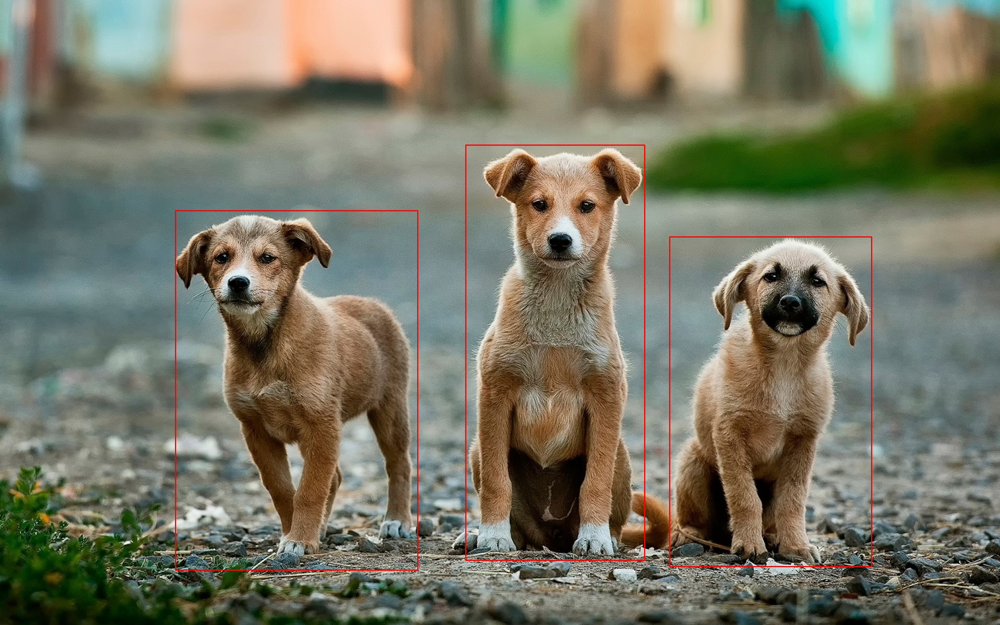

## tensorflow2_cpp

Sample example how to load a Tensorflow Object detection API v2 model and serve prediction in C++  

Accompanying [Medium post here](https://medium.com/@reachraktim/using-the-new-tensorflow-2-x-c-api-for-object-detection-inference-ad4b7fd5fecc)

## Build and installation

The current config uses the following dependencies (based on Tensorflow tested build). Check out [build from source configs](https://www.tensorflow.org/install/source#gpu) for more details.


1. Tensorflow 2.3.0
2. CUDA 10.1
3. cuDNN 7.6
4. Bazel 3.1.0
5. Protobuf 3.9.2
6. OpenCV 4.3.0 (required only for the example)

### Build Docker image

```bash
docker build . -t boraraktim/tensorflow2_cpp
```

### Compile source

1. Download the object detection model from [TF object detection model zoo](https://github.com/tensorflow/models/blob/master/research/object_detection/g3doc/tf2_detection_zoo.md). We use the [efficientdet_d3_coco17_tpu-32](http://download.tensorflow.org/models/object_detection/tf2/20200711/efficientdet_d3_coco17_tpu-32.tar.gz) for this example and unpack it.

2.  Start container and mount the model volume

```bash
docker run --gpus all -it --rm -v efficientdet_d3_coco17_tpu-32/:/object_detection/models/ boraraktim/tensorflow2_cpp
```
directory structure

```
-|/object_detection/models/
    -|efficientdet_d3_coco17_tpu-32
    	|--saved_model
            |--assets/
            |--saved_model.pb
            |-- ...
```

3. Build the project using cmake

```bash
root@8122f3e1dc5b:/object_detection# mkdir build
root@8122f3e1dc5b:/object_detection# cd build && cmake ..
root@8122f3e1dc5b:/object_detection/build# make
```

### Predict

```
./get_prediction <path/to/saved_model> <path/to/image.jpg> <path/to/output.jpg>
```

Example,


```bash
root@8122f3e1dc5b:/object_detection/build# ./get_prediction ../models/efficientdet_d3_coco17_tpu-32/saved_model/ ../test-image-anoir-chafik-2_3c4dIFYFU-unsplash.jpg ../sample_prediction.jpg
```



Image from [Unspalsh](https://unsplash.com/photos/2_3c4dIFYFU)
